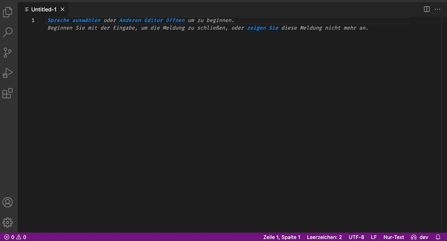

# DOPPLER VSCODE Extension

## Features

- Doppler environment status bar item
- Change your environment either by clicking the status bar item or by searching `Doppler: change` in the command palette
- Setup another doppler-project to be used in the current workspace by searching `Doppler: setup` in the command palette

## Requirements

You have doppler successfully installed and are already signed in.

## Known Issues

- When not signed in or other errors occur, this extension will only show an alert

## Release Notes

### 0.1.0

Initial release of the extension. Only features are changing the doppler env and project.

